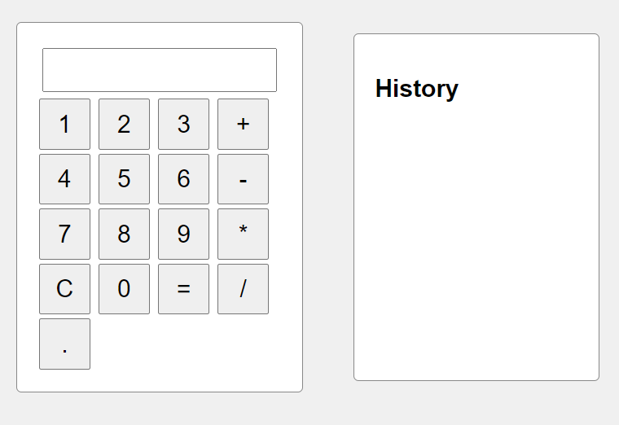
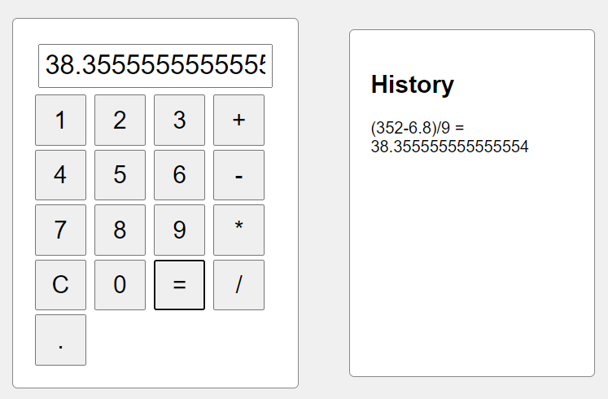

# 🧮 Calculator App

Welcome to the **Calculator App** project, created as part of the Occult Gurukul Software Development Engineer (SDE) Intern role assignment.

## 📖 Overview

This is a simple web application designed to perform basic arithmetic operations with a clean and user-friendly interface. Users can easily input numbers and operators to perform calculations.

## 🚀 Features

- **User-Friendly Interface:** Intuitive design for seamless navigation and interaction.
- **Basic Arithmetic Operations:** Supports addition, subtraction, multiplication, and division.
- **Error Handling:** Provides alerts for any calculation errors.
- **History Logging:** Tracks and displays previous calculations.

## 🛠️ Technologies Used

- **HTML**
- **CSS**
- **JavaScript**

## 🏁 Getting Started

To run the calculator app locally, follow these steps:

1. Clone the repository:
   ```bash
   git clone https://github.com/Ashwintomar/Calculator.git
   ```
   
2. Open `index.html` in your web browser.

## 📊 Usage

- Use the on-screen buttons to enter numbers and operators.
- Click `=` to perform the calculation.
- Click `C` to clear the display.
- The history section will display your previous calculations.

## 📸 Screenshots




## 🙏 Acknowledgments

A special thank you to **Occult Gurukul** for providing this internship assignment opportunity.

## 📫 Contact

For inquiries, please reach out to [Ashwin Tomar](mailto:ashwintomar04@gmail.com).
